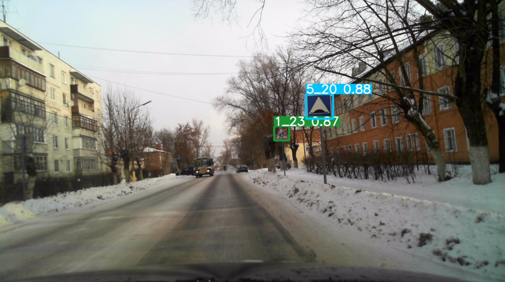
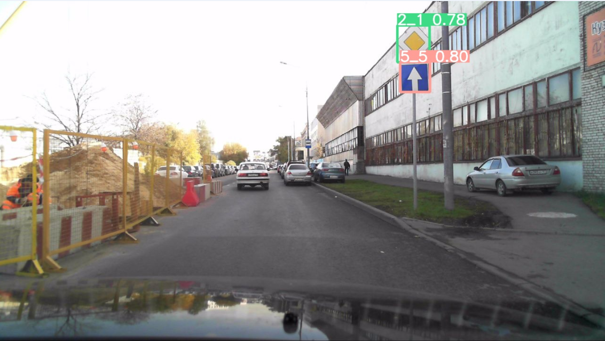

# Traffic sign detection with YOLOv5

## <summary>About dataset &nbsp;</summary>
Russian traffic sign images dataset (RTSD)

RTSD dataset contains frames provided by Geocenter Consulting company (http://geocenter-consulting.ru). Frames are obtained from widescreen digital video recorder which captures 5 frames per second. Frame resolution is from 1280×720 to 1920×1080. Frames are captured in different seasons (spring, autumn, winter), time of day (morning, afternoon, evening) and in different weather conditions (rain, snow, bright sun).

Download from Kaggle [here](https://www.kaggle.com/datasets/watchman/rtsd-dataset)

Dataset is described in this [article](http://computeroptics.ru/eng/KO/PDF/KO41-ENG%20-17/400221.pdf)

##  <summary>Usage Examples &nbsp;</summary>


### Dataset preprocessing
RTSD dataset preprocessing:

```bash
cd utils_data
python preprocessing.py --input_path './../input/rtsd' --output_path './../datasets/rtsd'

```

### Train
Train YOLOv5s on RTSD dataset:

```bash
cd yolov5
python train.py --img 1280 --batch 8 --epochs 100 --data ./../datasets/rtsd/data/traffic_signs.yaml --weights yolov5s6.pt --freeze 10

```

### Validate
Validate YOLOv5 on RTSD dataset:
```bash
cd yolov5
val.py --weights ./runs/train/{EXP_NAME}/weights/last.pt --data ./datasets/rtsd/data/traffic_signs.yaml --img 1280 --batch-size 8
```

### Predict
Use trained YOLOv5s to detect traffic signs:
```bash
cd yolov5
python detect.py --source ./../datasets/rtsd/data/val/images --weights .\runs\train\{EXP_NAME}\weights\last.pt --img 1280
```
 | 

### WEB
Use trained YOLOv5s to detect traffic signs via WEB. Run server:
```bash
cd rest_api
uvicorn main:app --host localhost --port 8000
```

### API
After run web server use HTTP POST requests (in details on localhost:8000/docs):
```bash
POST http://localhost:8000/detect
```


